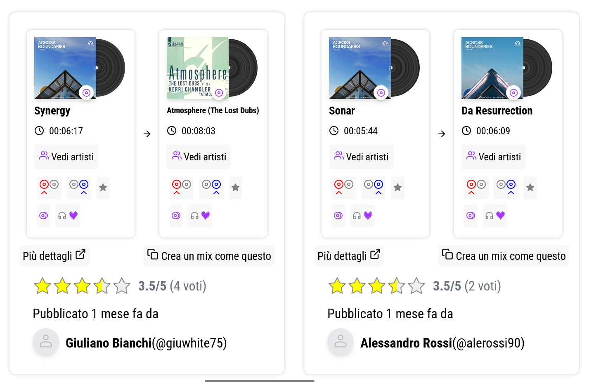

# 🪩 MixTo: Un social network dedicato ai DJ

## Web app del mio portfolio sviluppata in **React** + Express + MySQL

## [🌐 Puoi visitare MixTo qui](https://mixto.up.railway.app)

### ℹ️ Che cos'è MixTo?

MixTo è una web app **dedicata ai DJ** che permette sia di scroprire nuovi **mix** da provare nelle loro esibizioni sia di condividerli con gli altri utenti della piattaforma.
I DJ possono dare la loro opinione sui mix pubblicati **scrivendo commenti o votando**.
Tutti i **brani**, gli **album**, gli **artisti** e i **generi** musicali, vengono restituiti dalla [API pubblica di DEEZER developers](https://developers.deezer.com/login?redirect=/api)



### 🧑🏻‍💻 Come è stato realizzato?

Seguono le librerie, i framework e i linguaggi più importanti nella realizzazione di questa web app:

- **Front-end**
  - **React** con **React Router** per una navigazione rapida tra le pagine e le modal dell'app
  - **Typescript** con **Zod** per una validazione completa e a runtime dei tipi di dato nel codice, soprattutto per i dati restituiti dal back-end
  - **Tailwind CSS** per rendere il codice dello stile più leggibile e avere padding più coerenti
  - **Redux** per gestire lo stato globale nell'app e evitare il "props drilling"
- **Back-end**
  - **Node.js** con **Express** per l'implementazione delle API interne
  - **Axios** con **Bottleneck** per effettuare chiamate API a DEEZER rispettando il limite di 50 richieste ogni 5 secondi
  - **Typescript** con **Zod** per una validazione completa e a runtime dei tipi di dato nel codice
  - **Jest** per il testing automatico di tutte le API di ```GET```
- **Database**
  - **MySQL** per la persistenza di tutti i dati, comprese le copie locali dei brani associati ai mix pubblicati e alle liste di brani preferiti degli utenti


### 🛠️ Funzioni e codice ancora da sviluppare
